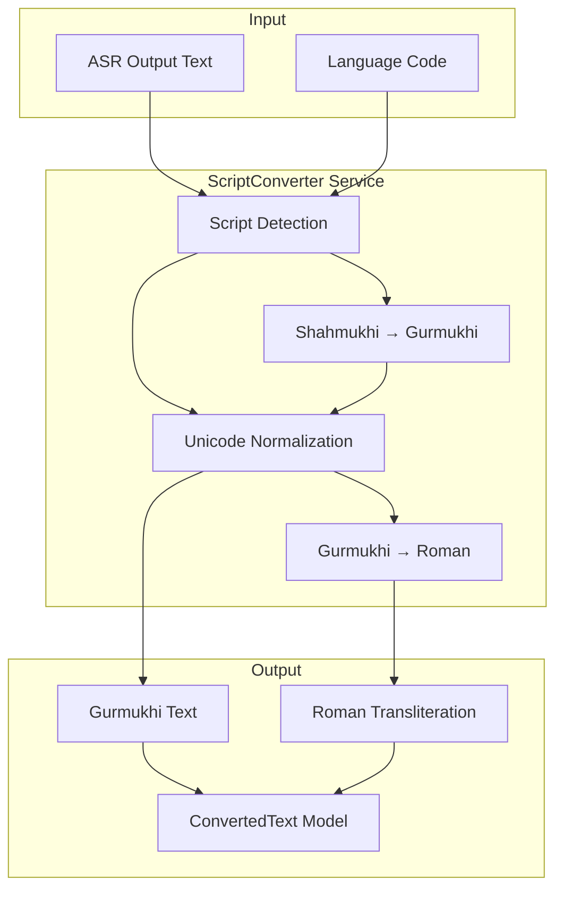

# Phase 3: Script Conversion - Implementation Plan

## 📋 Overview

**Goal**: Build the `script_converter.py` module that provides dual-output generation (Gurmukhi + Roman transliteration) and Shahmukhi to Gurmukhi conversion to address the core problem of Whisper outputting Urdu/Shahmukhi script instead of Gurmukhi.

**Problem Being Solved**:
- Current ASR outputs Shahmukhi/Urdu script (رام تنجی راکھ دے) instead of Gurmukhi (ਰਾਮ ਤੰਜੀ ਰਾਖ ਦੇ)
- No Roman transliteration for accessibility
- Low language confidence (36%) indicates model confusion

**Phase Duration**: Week 3 (as per main plan)

---

## 🎯 Scope (Files to Create/Modify)

### New Files:
| File | Purpose | Lines (Est.) |
|------|---------|--------------|
| `script_converter.py` | Core conversion service | 250-300 |
| `data/script_mappings.py` | Unicode character mapping tables | 150-200 |
| `test_phase3.py` | Comprehensive test suite | 200-250 |
| `PHASE3_COMPLETION_REPORT.md` | Completion documentation | - |
| `PHASE3_TEST_RESULTS.md` | Test results | - |

### Files to Modify:
| File | Modification |
|------|--------------|
| `models.py` | Add `ConvertedText` dataclass |
| `config.py` | Add Phase 3 configuration |
| `errors.py` | Add `ScriptConversionError` exception |
| `orchestrator.py` | Integrate script conversion into pipeline |
| `requirements.txt` | Add any new dependencies |

---

## 📚 Technical Research Summary

### Unicode Ranges
| Script | Unicode Range | Example |
|--------|---------------|---------|
| Gurmukhi | U+0A00 - U+0A7F | ਸਤਿ ਸ੍ਰੀ ਅਕਾਲ |
| Shahmukhi (Arabic) | U+0600 - U+06FF | ست سری اکال |
| Devanagari | U+0900 - U+097F | सत श्री अकाल |

### Key Character Mappings (Shahmukhi → Gurmukhi)
```
# Vowel marks
ا (Alif) → ਅ or ਾ (depends on position)
و (Waw) → ਓ or ੋ or ਵ (context-dependent)
ے (Ye) → ਏ or ੇ or ਈ
ی (Ye with dots) → ਯ or ੀ

# Consonants
ب → ਬ  |  پ → ਪ  |  ت → ਤ  |  ٹ → ਟ
ث → ਸ  |  ج → ਜ  |  چ → ਚ  |  ح → ਹ
خ → ਖ਼  |  د → ਦ  |  ڈ → ਡ  |  ذ → ਜ਼
ر → ਰ  |  ڑ → ੜ  |  ز → ਜ਼  |  ژ → ਜ਼
س → ਸ  |  ش → ਸ਼  |  ص → ਸ  |  ض → ਜ਼
ط → ਤ  |  ظ → ਜ਼  |  ع → (silent/ਅ)
غ → ਗ਼  |  ف → ਫ਼  |  ق → ਕ  |  ک → ਕ
گ → ਗ  |  ل → ਲ  |  م → ਮ  |  ن → ਨ
ں → ਂ (nasal)  |  ہ → ਹ  |  ھ → (aspiration mark)
```

### Gurmukhi → Roman Transliteration
Following IAST/ISO 15919 conventions with practical adjustments:
```
ਸ → s  |  ਤ → t  |  ਸ੍ਰੀ → srī  |  ਅਕਾਲ → akāl
ਾ → ā  |  ਿ → i  |  ੀ → ī  |  ੁ → u  |  ੂ → ū
ੇ → e  |  ੈ → ai  |  ੋ → o  |  ੌ → au
ਂ → ṃ (anusvara)  |  ਃ → ḥ (visarga)
ੱ → (doubles following consonant)
```

---

## 🏗️ Implementation Architecture



---

## 📝 Detailed Implementation Steps

### Milestone 3.1: Data Models & Exceptions (Est. 1 hour)

**(A) Goal**: Create shared data models for converted text and add custom exception

**(B) Scope**: `models.py`, `errors.py`

**(C) Implementation**:

1. Add to `models.py`:
```python
@dataclass
class ConvertedText:
    """Represents text with dual-script output."""
    original: str                    # Original ASR output
    original_script: str             # Detected script ("shahmukhi", "gurmukhi", "devanagari", "english", "mixed")
    gurmukhi: str                    # Gurmukhi representation
    roman: str                       # Roman transliteration
    confidence: float                # Conversion confidence (0.0-1.0)
    needs_review: bool               # Flag for uncertain conversions
    
    def to_dict(self) -> Dict[str, Any]:
        """Convert to dictionary for JSON serialization."""
        return {
            "original": self.original,
            "original_script": self.original_script,
            "gurmukhi": self.gurmukhi,
            "roman": self.roman,
            "confidence": self.confidence,
            "needs_review": self.needs_review
        }
```

2. Add to `errors.py`:
```python
class ScriptConversionError(TranscriptionError):
    """Raised when script conversion fails."""
    
    def __init__(self, source_script: str, target_script: str, reason: str = ""):
        message = f"Script conversion failed: {source_script} → {target_script}"
        if reason:
            message += f". Reason: {reason}"
        message += "\nFix: Check input text for unsupported characters"
        super().__init__(message)
        self.source_script = source_script
        self.target_script = target_script
        self.reason = reason
```

**(D) Tests**: Unit tests for model creation and serialization

**(E) Done Criteria**: Models created, tests pass

---

### Milestone 3.2: Unicode Mapping Tables (Est. 2 hours)

**(A) Goal**: Create comprehensive character mapping tables for script conversion

**(B) Scope**: `data/script_mappings.py` (new file)

**(C) Implementation**:

1. Create `data/__init__.py` (empty)

2. Create `data/script_mappings.py`:
```python
"""
Unicode character mapping tables for script conversion.

This module contains:
1. Shahmukhi (Arabic-based Punjabi) to Gurmukhi mapping
2. Gurmukhi to Roman (ISO 15919 based) mapping
3. Special handling for nasalization, aspiration, nukta, etc.
"""

# Shahmukhi to Gurmukhi consonant mapping
SHAHMUKHI_TO_GURMUKHI_CONSONANTS: Dict[str, str] = {
    'ب': 'ਬ',  # ba
    'پ': 'ਪ',  # pa
    'ت': 'ਤ',  # ta
    'ٹ': 'ਟ',  # tta (retroflex)
    'ث': 'ਸ',  # sa (Arabic origin)
    'ج': 'ਜ',  # ja
    'چ': 'ਚ',  # cha
    # ... complete mapping
}

# Gurmukhi to Roman transliteration
GURMUKHI_TO_ROMAN: Dict[str, str] = {
    'ਸ': 's', 'ਹ': 'h', 'ਕ': 'k', 'ਖ': 'kh',
    # ... complete mapping
}

# Vowel mappings (context-dependent)
SHAHMUKHI_VOWELS: Dict[str, List[str]] = {
    'ا': ['ਅ', 'ਾ'],  # Alif: initial ਅ, medial ਾ
    # ... etc
}
```

**(D) Tests**: Validate mapping completeness, no duplicates

**(E) Done Criteria**: Complete mapping tables with documentation

---

### Milestone 3.3: Script Detection Service (Est. 2 hours)

**(A) Goal**: Implement script detection to identify input text script

**(B) Scope**: `script_converter.py` (partial)

**(C) Implementation**:

```python
class ScriptDetector:
    """Detects the script of input text."""
    
    # Unicode ranges
    GURMUKHI_RANGE = range(0x0A00, 0x0A80)
    SHAHMUKHI_RANGE = range(0x0600, 0x0700)
    DEVANAGARI_RANGE = range(0x0900, 0x0980)
    LATIN_RANGE = range(0x0041, 0x007B)  # A-Z, a-z
    
    def detect_script(self, text: str) -> Tuple[str, float]:
        """
        Detect predominant script in text.
        
        Returns:
            Tuple of (script_name, confidence)
        """
        # Count characters by script
        # Return dominant script with confidence
```

**(D) Tests**: Test with Gurmukhi, Shahmukhi, English, mixed texts

**(E) Done Criteria**: Accurate script detection ≥95%

---

### Milestone 3.4: Shahmukhi → Gurmukhi Converter (Est. 4 hours)

**(A) Goal**: Implement accurate Shahmukhi to Gurmukhi transliteration

**(B) Scope**: `script_converter.py`

**(C) Implementation Challenges**:

1. **Vowel handling**: Arabic script is abjad (vowels often omitted)
   - Strategy: Use common Punjabi word patterns, context
   
2. **Ambiguous mappings**: Multiple possible Gurmukhi outputs
   - Strategy: Priority-based selection, dictionary lookup for common words
   
3. **Direction**: Shahmukhi is RTL, Gurmukhi is LTR
   - Strategy: Reverse character order during conversion

4. **Nukta characters**: Represent non-native Punjabi sounds
   - Strategy: Map with nukta variants (ਖ਼, ਗ਼, ਜ਼, ਫ਼, ਲ਼, ਸ਼)

```python
class ShahmukiToGurmukhiConverter:
    """Converts Shahmukhi (Arabic-based Punjabi) to Gurmukhi script."""
    
    def __init__(self):
        self.consonant_map = SHAHMUKHI_TO_GURMUKHI_CONSONANTS
        self.vowel_map = SHAHMUKHI_VOWELS
        # Common word dictionary for disambiguation
        self.common_words: Dict[str, str] = {}
    
    def convert(self, text: str) -> Tuple[str, float]:
        """
        Convert Shahmukhi text to Gurmukhi.
        
        Returns:
            Tuple of (gurmukhi_text, confidence)
        """
        # 1. Unicode normalize
        # 2. Handle word-by-word (check dictionary first)
        # 3. Fall back to character-by-character with context
        # 4. Calculate confidence based on mapping certainty
```

**(D) Tests**: 
- Known word pairs from sample transcriptions
- Edge cases: numbers, punctuation, mixed text

**(E) Done Criteria**: ≥85% accuracy on sample texts

---

### Milestone 3.5: Gurmukhi → Roman Transliterator (Est. 3 hours)

**(A) Goal**: Implement Gurmukhi to Roman transliteration

**(B) Scope**: `script_converter.py`

**(C) Implementation**:

```python
class GurmukhiToRomanTransliterator:
    """Transliterates Gurmukhi text to Roman script."""
    
    def __init__(self, scheme: str = "iso15919"):
        """
        Initialize with transliteration scheme.
        
        Args:
            scheme: "iso15919" (academic), "iast", or "practical" (simplified)
        """
        self.scheme = scheme
        self.char_map = self._load_scheme(scheme)
    
    def transliterate(self, gurmukhi_text: str) -> str:
        """
        Transliterate Gurmukhi to Roman script.
        
        Handles:
        - Vowel matras (dependent vowels)
        - Gemination (ੱ adhak)
        - Nasalization (ਂ bindi, ਁ tippi)
        - Nukta consonants (ਖ਼, ਗ਼, etc.)
        - Half forms (pairin/sihari)
        """
```

Transliteration scheme options:
| Scheme | ਸਤਿ ਸ੍ਰੀ ਅਕਾਲ | Use Case |
|--------|---------------|----------|
| ISO 15919 | sati srī akāla | Academic/scholarly |
| IAST | sati srī akāla | Sanskrit-based |
| Practical | Sat Sri Akal | User-friendly display |

**(D) Tests**: Standard phrases, all vowel combinations, special characters

**(E) Done Criteria**: ≥98% accuracy on Gurmukhi text

---

### Milestone 3.6: Main ScriptConverter Service (Est. 2 hours)

**(A) Goal**: Create unified service integrating all converters

**(B) Scope**: `script_converter.py` (main class)

**(C) Implementation**:

```python
"""
Script conversion service for dual-output generation.

Provides:
1. Automatic script detection
2. Shahmukhi to Gurmukhi conversion
3. Gurmukhi to Roman transliteration
4. Dual-output (Gurmukhi + Roman) generation
"""
import logging
from typing import Optional, Dict, Any
from models import ConvertedText
from errors import ScriptConversionError
import config

logger = logging.getLogger(__name__)


class ScriptConverter:
    """
    Main service for script conversion and transliteration.
    
    Converts ASR output (which may be in Shahmukhi/Urdu) to:
    1. Gurmukhi script (ਪੰਜਾਬੀ)
    2. Roman transliteration (Panjābī)
    """
    
    def __init__(
        self,
        roman_scheme: str = "practical",
        enable_dictionary_lookup: bool = True
    ):
        """
        Initialize script converter.
        
        Args:
            roman_scheme: Romanization scheme ("iso15919", "iast", "practical")
            enable_dictionary_lookup: Use common word dictionary for disambiguation
        """
        self.detector = ScriptDetector()
        self.shahmukhi_converter = ShahmukiToGurmukhiConverter()
        self.romanizer = GurmukhiToRomanTransliterator(scheme=roman_scheme)
        self.enable_dictionary = enable_dictionary_lookup
        logger.info(f"ScriptConverter initialized with scheme='{roman_scheme}'")
    
    def convert(
        self,
        text: str,
        source_language: Optional[str] = None
    ) -> ConvertedText:
        """
        Convert text to dual-output (Gurmukhi + Roman).
        
        Args:
            text: Input text from ASR
            source_language: Language code from ASR (e.g., "ur", "pa", "hi")
        
        Returns:
            ConvertedText with Gurmukhi and Roman representations
        """
        if not text or not text.strip():
            return ConvertedText(
                original=text,
                original_script="empty",
                gurmukhi="",
                roman="",
                confidence=1.0,
                needs_review=False
            )
        
        # Step 1: Detect script
        script, detect_confidence = self.detector.detect_script(text)
        logger.debug(f"Detected script: {script} (confidence: {detect_confidence:.2f})")
        
        # Step 2: Convert to Gurmukhi if needed
        if script == "gurmukhi":
            gurmukhi_text = text
            convert_confidence = 1.0
        elif script == "shahmukhi":
            gurmukhi_text, convert_confidence = self.shahmukhi_converter.convert(text)
            logger.debug(f"Converted Shahmukhi → Gurmukhi (confidence: {convert_confidence:.2f})")
        elif script == "english":
            # Keep English as-is for Gurmukhi field, romanize as-is
            gurmukhi_text = text
            convert_confidence = 1.0
        else:
            # Mixed or unknown - attempt best-effort conversion
            gurmukhi_text, convert_confidence = self._convert_mixed(text)
        
        # Step 3: Romanize
        if script == "english":
            roman_text = text
        else:
            roman_text = self.romanizer.transliterate(gurmukhi_text)
        
        # Step 4: Calculate overall confidence
        overall_confidence = detect_confidence * convert_confidence
        needs_review = overall_confidence < config.SCRIPT_CONVERSION_CONFIDENCE_THRESHOLD
        
        if needs_review:
            logger.warning(f"Low conversion confidence ({overall_confidence:.2f}), flagging for review")
        
        return ConvertedText(
            original=text,
            original_script=script,
            gurmukhi=gurmukhi_text,
            roman=roman_text,
            confidence=overall_confidence,
            needs_review=needs_review
        )
    
    def convert_segments(
        self,
        segments: list,
        source_language: Optional[str] = None
    ) -> list:
        """
        Convert a list of segments, updating text fields.
        
        Args:
            segments: List of segment dicts with 'text' field
            source_language: Language code from ASR
        
        Returns:
            Updated segments with converted text
        """
        converted_segments = []
        for segment in segments:
            text = segment.get('text', '')
            converted = self.convert(text, source_language)
            
            # Update segment with converted text
            updated_segment = segment.copy()
            updated_segment['gurmukhi'] = converted.gurmukhi
            updated_segment['roman'] = converted.roman
            updated_segment['original_script'] = converted.original_script
            updated_segment['script_confidence'] = converted.confidence
            
            if converted.needs_review:
                updated_segment['needs_review'] = True
            
            converted_segments.append(updated_segment)
        
        return converted_segments
```

**(D) Tests**: End-to-end conversion from ASR output

**(E) Done Criteria**: Full conversion pipeline working

---

### Milestone 3.7: Configuration Updates (Est. 30 min)

**(A) Goal**: Add Phase 3 configuration parameters

**(B) Scope**: `config.py`

**(C) Implementation**:

```python
# Phase 3: Script Conversion Configuration
SCRIPT_CONVERSION_CONFIDENCE_THRESHOLD = 0.7  # Flag for review below this
ROMAN_TRANSLITERATION_SCHEME = "practical"  # Options: "iso15919", "iast", "practical"
ENABLE_DICTIONARY_LOOKUP = True  # Use common word dictionary for disambiguation

# Character normalization
UNICODE_NORMALIZATION_FORM = "NFC"  # NFC, NFD, NFKC, NFKD
```

**(D) Tests**: Configuration loads correctly

**(E) Done Criteria**: All thresholds documented

---

### Milestone 3.8: Orchestrator Integration (Est. 2 hours)

**(A) Goal**: Integrate script conversion into transcription pipeline

**(B) Scope**: `orchestrator.py`

**(C) Implementation**:

Update `Orchestrator.__init__`:
```python
from script_converter import ScriptConverter

# In __init__:
self.script_converter = ScriptConverter(
    roman_scheme=getattr(config, 'ROMAN_TRANSLITERATION_SCHEME', 'practical'),
    enable_dictionary_lookup=getattr(config, 'ENABLE_DICTIONARY_LOOKUP', True)
)
```

Update `transcribe_file` to apply conversion:
```python
# After fusion, before adding to segments:
converted = self.script_converter.convert(
    fusion_result.fused_text,
    source_language=asr_a_result.language
)

# Update segment with converted text
processed_segment = ProcessedSegment(
    ...
    text=converted.gurmukhi,  # Use Gurmukhi as primary
    ...
)

# Store both scripts in transcription dict
transcription = {
    "gurmukhi": total_gurmukhi_text.strip(),
    "roman": total_roman_text.strip()
}
```

**(D) Tests**: Full pipeline test with script conversion

**(E) Done Criteria**: Pipeline produces dual-output

---

### Milestone 3.9: Test Suite (Est. 3 hours)

**(A) Goal**: Create comprehensive test suite

**(B) Scope**: `test_phase3.py`

**(C) Test Categories**:

1. **Unit Tests - Script Detection**:
   - Detect pure Gurmukhi text
   - Detect pure Shahmukhi text
   - Detect English text
   - Detect mixed text
   - Empty/whitespace input

2. **Unit Tests - Shahmukhi Conversion**:
   - Basic consonant mapping
   - Vowel handling
   - Nasalization
   - Nukta characters
   - RTL to LTR conversion
   - Sample words from existing transcriptions

3. **Unit Tests - Roman Transliteration**:
   - Basic consonants
   - All vowel combinations (independent + dependent)
   - Gemination (adhak)
   - Nasalization (bindi, tippi)
   - Conjuncts (half forms)
   - Nukta consonants

4. **Integration Tests**:
   - Full conversion pipeline
   - Segment conversion
   - Orchestrator integration

5. **Edge Cases**:
   - Empty input
   - Punctuation only
   - Numbers
   - Mixed script words
   - Unknown characters

**(D) Sample Test Data**:
```python
TEST_CASES = [
    # (Shahmukhi, Expected Gurmukhi, Expected Roman)
    ("دھن گرنانک", "ਧੰਨ ਗੁਰਨਾਨਕ", "Dhan Guranānak"),
    ("مہاراج", "ਮਹਾਰਾਜ", "Mahārāj"),
    # ... from actual transcription outputs
]
```

**(E) Done Criteria**: All tests pass, ≥80% coverage

---

### Milestone 3.10: Documentation & Completion (Est. 1 hour)

**(A) Goal**: Document implementation and verify compliance

**(B) Scope**: Documentation files, README update

**(C) Implementation**:
- Create `PHASE3_COMPLETION_REPORT.md`
- Create `PHASE3_TEST_RESULTS.md`
- Update `README.md` with Phase 3 features

**(D) Done Criteria**: All documentation complete, rules compliance verified

---

## 🗓️ Timeline

| Milestone | Duration | Dependencies |
|-----------|----------|--------------|
| 3.1 Data Models | 1 hour | None |
| 3.2 Mapping Tables | 2 hours | 3.1 |
| 3.3 Script Detection | 2 hours | 3.2 |
| 3.4 Shahmukhi Converter | 4 hours | 3.2, 3.3 |
| 3.5 Roman Transliterator | 3 hours | 3.2 |
| 3.6 Main Service | 2 hours | 3.3, 3.4, 3.5 |
| 3.7 Configuration | 0.5 hours | 3.6 |
| 3.8 Orchestrator | 2 hours | 3.6, 3.7 |
| 3.9 Test Suite | 3 hours | 3.8 |
| 3.10 Documentation | 1 hour | 3.9 |

**Total Estimated Time**: ~20 hours

---

## 📋 Definition of Done Checklist

### Per-Milestone:
- [ ] Type hints on all public functions
- [ ] Logging with `logging.getLogger(__name__)`
- [ ] Error handling with custom exceptions
- [ ] Unit tests created and passing
- [ ] No magic numbers (all in config)

### Phase Completion:
- [ ] All milestones complete
- [ ] Full test suite passes
- [ ] Integration with orchestrator verified
- [ ] Sample transcription shows Gurmukhi + Roman output
- [ ] README.md updated
- [ ] PHASE3_COMPLETION_REPORT.md created
- [ ] PHASE3_TEST_RESULTS.md created
- [ ] Git commit with all changes

---

## 🔬 Sample Expected Output

**Before Phase 3** (current):
```json
{
  "transcription": "رام تنجی راکھ دے اندر دھن گرنانک دیو جی مہاراج",
  "language": "ur",
  "language_probability": 0.36
}
```

**After Phase 3** (expected):
```json
{
  "transcription": {
    "gurmukhi": "ਰਾਮ ਤੰਜੀ ਰਾਖ ਦੇ ਅੰਦਰ ਧੰਨ ਗੁਰਨਾਨਕ ਦੇਵ ਜੀ ਮਹਾਰਾਜ",
    "roman": "Rām tanjī rākh de andar dhan guranānak dev jī mahārāj"
  },
  "segments": [
    {
      "start": 16.5,
      "end": 21.0,
      "text": "ਰਾਮ ਤੰਜੀ ਰਾਖ ਦੇ ਅੰਦਰ...",
      "gurmukhi": "ਰਾਮ ਤੰਜੀ ਰਾਖ ਦੇ ਅੰਦਰ...",
      "roman": "Rām tanjī rākh de andar...",
      "original_script": "shahmukhi",
      "script_confidence": 0.85
    }
  ]
}
```

---

## ⚠️ Known Challenges & Mitigations

| Challenge | Mitigation |
|-----------|------------|
| Vowel ambiguity in Shahmukhi | Use common word dictionary + context patterns |
| ASR errors propagating | Keep original text, flag low confidence |
| Unknown/rare characters | Log and pass through unchanged |
| Performance with large texts | Process segment-by-segment, use caching |
| Mixed-script text | Detect per-word, convert independently |

---

## 📚 References

1. **Unicode Charts**:
   - [Gurmukhi Block](https://www.unicode.org/charts/PDF/U0A00.pdf)
   - [Arabic Block](https://www.unicode.org/charts/PDF/U0600.pdf)

2. **Transliteration Standards**:
   - [ISO 15919](https://en.wikipedia.org/wiki/ISO_15919) - Devanagari family
   - [IAST](https://en.wikipedia.org/wiki/IAST) - Sanskrit romanization

3. **Existing Resources**:
   - ShabadOS Database for canonical text verification
   - Common Punjabi word lists for disambiguation

---

## 🚀 Ready to Begin

This plan is ready for implementation. Start with **Milestone 3.1** (Data Models) and proceed sequentially through the milestones.

**Command to start**:
```bash
# Ensure you're in the project directory
cd C:\Ideas\KathaTranscription

# Create data directory
mkdir -p data

# Begin implementation...
```
